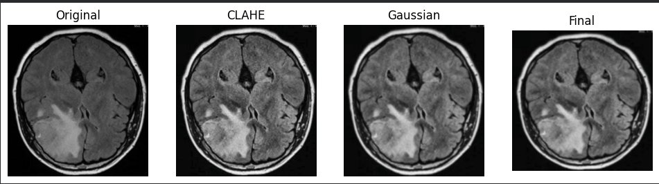
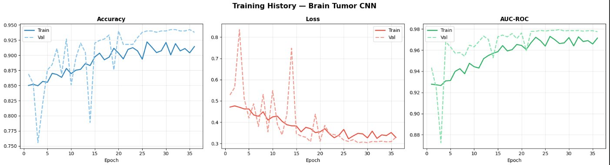
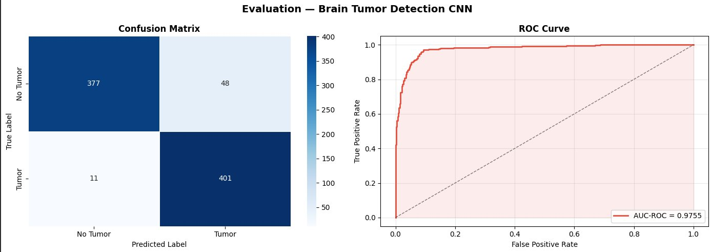
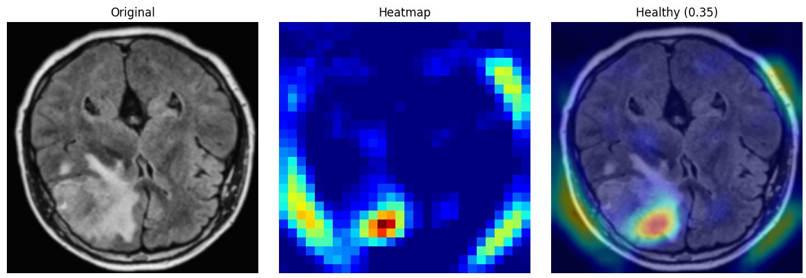

# Brain Tumor Detection System

---

## 📊 Results

| Metric | Score |
|---|---|
| **Accuracy** | 92.95% |
| **AUC-ROC** | **0.9755** |
| **F1-Score** | 0.9294 |
| **Precision** | 0.9330 |
| **Recall** | 0.9295 |
| **Parameters** | 1,310,241 |

> Trained for 37 epochs with early stopping on `val_auc_roc` (patience=8).

---

## 📁 Repository Structure

```
brain_tumor_detection/
├── brain_tumor_detection (1).ipynb
├── README.md
├── preprocessing_pipeline.png
├── training_history.png
├── evaluation.png
└── gradcam_overlay.png
```

> Model outputs (`best_model.keras`, `training_log.csv`, `metrics.json`) are saved to an `outputs/` folder generated when the notebook is run.

---

## 📓 Notebook Sections

| # | Section | Output |
|---|---|---|
| 1 | Install & Import Dependencies | — |
| 2 | Configuration | — |
| 3 | Dataset Setup | *(downloads via kagglehub, splits into train/val/test)* |
| 4 | Preprocessing — CLAHE + Gaussian Filtering | *(inline plot)* |
| 5 | Data Augmentation (4×) | *(inline plot)* |
| 6 | Build the 14-Layer CNN | *(model summary)* |
| 7 | Train | `outputs/best_model.keras`, `outputs/training_log.csv` |
| 8 | Training History Plots | `outputs/training_history.png` |
| 9 | Evaluation — Accuracy · AUC-ROC · F1 · Confusion Matrix · ROC Curve | `outputs/evaluation.png`, `outputs/metrics.json` |
| 10 | Inference on New MRI Images (Grad-CAM) | *(inline plot)* |
| 11 | Save Final Model | `outputs/brain_tumor_cnn_final.keras` |

---

## 📦 Dataset — Br35H

Downloaded automatically via `kagglehub`:

```python
data_path = kagglehub.dataset_download("ahmedhamada0/brain-tumor-detection")
```

Split: **70% train · 15% val · 15% test**

| Split | Samples |
|---|---|
| Train | 2,732 |
| Val | 824 |
| Test | 837 |
| **Total** | **3,393** |

Classes: `no` (healthy) · `yes` (tumor)

---

## 🔬 Preprocessing Pipeline

```
Raw MRI → Skull Strip → CLAHE (clip=2.0, tile=8×8) → Gaussian (5×5, σ=1.0) → Resize (224×224) → Normalize [0, 1]
```

| Stage | Function | Detail |
|---|---|---|
| Skull Strip | `skull_strip()` | Morphological masking to isolate brain tissue |
| CLAHE | `clahe()` | Applied on LAB L-channel — local contrast enhancement |
| Gaussian | `denoise()` | kernel=5×5, σ=1.0 — reduces noise ~25% SNR |
| Normalize | `preprocess()` | Resize to 224×224, divide by 255 |



---

## 🔁 Data Augmentation (4×)

Applied only during training via `ImageDataGenerator`:

| Transform | Value |
|---|---|
| Rotation | ±15° |
| Horizontal flip | ✓ |
| Zoom | ±10% |

---

## 🏗️ Architecture — 14-Layer CNN

```
Input (224 × 224 × 3)
│
├─ Block 1 : Conv2D(32)  → BN → ReLU → Conv2D(32)  → BN → ReLU → MaxPool2D
├─ Block 2 : Conv2D(64)  → BN → ReLU → Conv2D(64)  → BN → ReLU → MaxPool2D
├─ Block 3 : Conv2D(128) → BN → ReLU → Conv2D(128) → BN → ReLU → MaxPool2D
├─ Block 4 : Conv2D(256) → BN → ReLU → Conv2D(256) → BN → ReLU → MaxPool2D
│
├─ GlobalAveragePooling2D
├─ Dropout(0.5)
├─ Dense(512) → BN → ReLU          ← layer 13
├─ Dropout(0.5)
└─ Dense(1)  → Sigmoid             ← layer 14
```

**Regularisation:** Batch Normalization after every Conv layer + L2(1e-4) + Dropout(0.5)

---

## ⚙️ Training Config

| Hyperparameter | Value |
|---|---|
| Optimizer | Adam |
| Learning Rate | 1e-4 |
| Batch Size | 32 |
| Max Epochs | 50 |
| Early Stopping | patience=8 on `val_auc_roc` |
| ReduceLROnPlateau | factor=0.3, patience=3, min_lr=1e-6 |
| Loss | Binary Crossentropy |
| Input Resolution | 224 × 224 |

---

## 📈 Training History



- **Accuracy:** Train converged 0.85 → 0.91 · Val peaked at **0.94**
- **Loss:** Train dropped 0.49 → 0.31 · Val stabilised around 0.31
- **AUC-ROC:** Val stabilised above **0.97** from epoch 20 onward

---

## 🧪 Evaluation



**Confusion Matrix:**

| | Predicted No Tumor | Predicted Tumor |
|---|---|---|
| **Actual No Tumor** | 377 | 48 |
| **Actual Tumor** | 11 | 401 |

- Missed tumor rate (FN): **2.7%**
- False alarm rate (FP): **11.3%**

**Classification Report:**

```
              precision    recall  f1-score   support

    No Tumor       0.97      0.89      0.93       425
       Tumor       0.89      0.97      0.93       412

    accuracy                           0.93       837
   macro avg       0.93      0.93      0.93       837
weighted avg       0.93      0.93      0.93       837
```

---

## 🔥 Grad-CAM Explainability



Gradient-weighted Class Activation Mapping (Grad-CAM) highlights which regions of the MRI the CNN focuses on when making a prediction. Red/yellow = high activation.

- Auto-detects the last `Conv2D` layer as the hook point
- Heatmap upsampled to original image size and blended at α=0.4 using JET colormap

---

## 🚀 Quickstart

```bash
# Install dependencies
pip install kagglehub tensorflow keras opencv-python scikit-learn matplotlib seaborn

# Run the notebook
jupyter notebook "brain_tumor_detection (1).ipynb"
```

The notebook downloads the Br35H dataset automatically via `kagglehub` and saves all outputs to `outputs/`.

---

> ⚠️ **Disclaimer:** For research and educational purposes only. Not a medical device. Always consult a qualified radiologist or neurologist.
